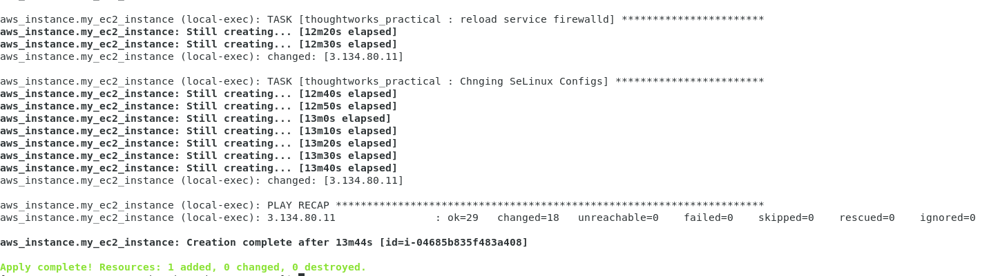
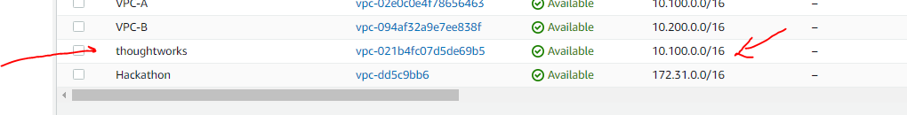
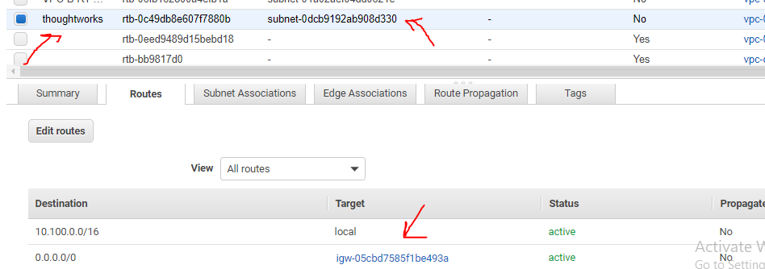

# Prerequisite to use this repo

## Problem statement 

MEDIAWIKI PROBLEM STATEMENT  

We want to automate the deployment of MediaWiki using.

Kubernetes with Helm Chart/ any equivalent automation with own Dockerfiles for application and database.
Terraform or any IaC tool with any Configuration Management tool integrated.

## Solution

I am choosing Method 3 & using Cloud as Azure . You can validate it two way  

a) Quick Run Locally

b) CI/ CD process  

I can also see some challenges on Scaling of this mediawiki app . Which are mentioned [over here](https://github.com/anurag4517/assignment#scaling-challenges-for-mediawiki).  

### Quick run Locally
Step 1 : Ensure that you have full filled prerequisite .
Step 2:  Clone this project locally  

`git clone https://github.com/cloudpassion1801/assignment.git ;`  

Step 3: Create a local docker container environment to run flow . You can run these command locally too , but different configurations of different machines may impact flow .
So inorder to have consistent environment its best to run them inside a docer container  

` cd assignment ; `  
`docker build -t project .`  
`docker run --volume $(pwd):/app -it project /bin/bash ;`  
Set credentials on container. These are the SP credentiails which was created before  
`export ARM_SUBSCRIPTION_ID="XXXXX-XXXXX-XXXXX"`  
`export ARM_TENANT_ID="XXXX-XXXX-XXXX-XXXX-"`  
`export ARM_CLIENT_ID="XXXX-XXXX-XXXX-XXXX" `  
`export ARM_CLIENT_SECRET="XXXXXXXXXXXXXXXXXX"`  

Step 4:  Create terrafrom infra  
`cd terraformcodeazure ; `  
   ` terraform init;`  
   ` terraform plan;`  
   ` terraform apply -auto-approve; `  
   This process will create basic infra for 
   ` terraform output -raw private_key > id_rsa`  
   ` chmod 600 id_rsa`  
    `public_ip = ${terraform output -raw public_ip_address } `  

f) Validate created Infra  

g) Run configuration Management tool (Ansible) for installing mediawiki in VM
    `echo ${public_ip} `  
    `./ansible.sh ${public_ip} `  

Once this succeeds you can view mediawiki running n http://{ip_address} , where ip_address is ip of instance created on Azure  
 

#### Quick Run prerequisite  

a) Should have a valid Azure account and subscriptions & Install Azure cli . You can view documetation [here](https://registry.terraform.io/providers/hashicorp/azurerm/latest/docs/guides/service_principal_client_secret) .  

b) Should have created a SP(Servic principle) in Azure with Contributor Access to help terraform create resources . You can find details [here](https://github.com/anurag4517/assignment#code-for-creating-sp-for-azure) . 

c) Docker should be installed locally on system.  

### CI/CD Process  
Step 1 : Ensure that you have full filled [CI/CD prerequisite](https://github.com/anurag4517/assignment#entire-cicd-prerequisite) .  

Step 2 : [Run Jenkins Server Locally](https://github.com/anurag4517/assignment#step-1--run-jenkins-server-locally-via-following-command) . Ideally we should have a Jenkins CI server running where we would configure our job , but here we are running it locally via docker container .

Step 3 : [Configure Jenkins credentiails](https://github.com/anurag4517/assignment#configure-your-jenkins-credentials) .  

Step 4 : [Create a PR to deploy infra to stagging environment](https://github.com/anurag4517/assignment#create-a-pr-to-deploy-infra-to-stagging-environment)  

Step 5 : [Validate app in stagging environment](https://github.com/anurag4517/assignment#create-a-pr-to-deploy-infra-to-stagging-environment) and once validated merge PR to main to deploy it to prod  

Step 6 : Validate app in prod environment.  

### Entire CI/CD prerequisite  

For complete CI/CD examination you need to have below things

a) Should have a valid Azure account and subscriptions & Install Azure cli . You can view documetation [here](https://registry.terraform.io/providers/hashicorp/azurerm/latest/docs/guides/service_principal_client_secret) .  

b) Should have created a SP(Servic principle) in Azure with Contributor Access to help terraform create resources . You can find details [here](https://github.com/anurag4517/assignment#code-for-creating-sp-for-azure) . 

c) Docker should be installed locally on system.  

d) Run Jenkins Server Locally . Ideally we should have a Jenkins CI server running where we would configure our job , but here we are running it locally via docker container .

e)  Configure Jenkins credentiails .

### Code for creating SP for Azure 

`az ad sp create-for-rbac --name thoughtworks --role Contributor --scopes /subscriptions/{yourSubcriptionId}`

Output will Look like something below : 
`{
  "appId": "XXXXXXX-202b-4fe4-be81-XXXXXXX",
  "displayName": "thoughtworks",
  "password": "XXXXXXXXXXXXXXXXXX",
  "tenant": "4e38ff80-f300-XXXXXXXXX"
}`

### Step 1 : Run Jenkins Server Locally via following command.  

`docker run --privileged -u 0 -p 8081:8080 -p 50000:50000 -v ${pwd}/jenkinsjob:/var/jenkins_home  jenkinsci/blueocean` 

Open `http:\\localhost:8080`

### Configure Your Jenkins credentials  

(SP --> appId , password , tennant )

Manage Jenkins > Credentials > Add 

Add 3 credentials Namely `APP_ID` `APP_PASSWORD` `APP_TENANT`  

### Create a PR to deploy infra to stagging environment  

### Validate app in stagging environment

### Validate app in prod environment

### Scaling challenges for mediawiki  

## *******   Improovements from master branch *******

Master branch is basically simple implementation (POC) of problem statement in this branch I have tried to implement over all best practices which are ideal for production based system    

## ******     Security Wise improovements *************

### a) Using Backend to store terraform state file (S3 bucket)  

We habe created a S3 bucket and configured it as backend + enabled encryption on it so that our state file could be shred accross various developers .
Due to encryption its data is also not interpretted by anyone .

### b) Using Jenkins Plugin to store AWS secret Access Key  
Before doing terraform apply we have to configure AWS secret and Access key ID to authenticate terraform with your AWS cloud . We have used Global jenkins configuration to store that information , so that no one could steal your credentials . Only Jenkins admin should have authorization to change those credentials

### c) Sensitive O/P Parameters are encoded  

### d) Encrypted ansible vars file via Ansible Vault (Still to be implemented ,More efficient method is using Ansible tower and credentials .Need more time for same ETC : 1 day )  
There might be some sensitive parametes which should not be stored normally on Source control . We should encrypt then via ansible vault and use credentils to store key of it and call the template using Ansible tower api key via http.  

## ****** CI /CD Implementation using Jenkins *********  
  
Assuming code for Config management is getting change via developer . I have implemented Jenkins CI model to always have latest infra running at AWS   
a) It will install ansible & terraform within ubuntu docker image  
b) Will do a Plan to show what things needed to be added by comparing state file stored at remote backend i.e S3.  
c) Will Apply the changes to AWS Envionment . ( There can also be an approval process to deploy code via mail . That can also be implemented )
d) Once deployed reciept list will get mail sharing details 

Use below command to see already built docker image which have all the required configurations and plugins installed at local github as volume  
`sudo docker run --privileged -u 0 -p 8081:8080 -p 50000:50000 -v /root/thoughtworks_assgnment/jenkinsjobinfo:/var/jenkins_home -v /var/run/docker.sock:/var/run/docker.sock jenkinsci/blueocean `   

## ******** Organized Folder structure ***********
Now All code is organized into 3 folders  
a) Terraform code : All terraform related code is stored over here   
b) Ansible Code: All ansible related is stored over here    
c) Jenkins Job Info : Volume reserved for jenkins build related activities  
d) Jenkinsfile : Contains Jenkins Pipeline related Code  

  

# Problem Statement

### We want you to automate the deployment of MediaWiki using one that you are most comfortable  with:

#### Kubernetes with Helm Chart/ any equivalent automation
#### CFT with Any Configuration Management Tool (Only for AWS). If any 
#### Terraform with any Configuration Management tool integrated.

[Link to documentation How to install it](http://www.mediawiki.org/wiki/Manual:Running_MediaWiki_on_Red_Hat_Linux)

# Solution

I am choosing Method 3 & using Cloud as AWS i.e 

####  Terraform with any Configuration Management tool integrated

## Pre-Requisite 

### a) Must have an account on AWS .Plus Should have valid AWS user (Access Key and Secret ID) with permissions atleast to create Insrance/VPC/Subnet/IGW/Routetable

If you donot Have above follow below Links and steps
* [Create Free tier AWS Account](https://aws.amazon.com/free/) 
* [Get Acess Key and Secret](https://docs.aws.amazon.com/IAM/latest/UserGuide/id_users_create.html)
* [EC2 Key Pair](https://docs.aws.amazon.com/cli/latest/userguide/cli-services-ec2-keypairs.html)

#### Wget your .pem file here

> wget {{url}}  
> chmod 400 {{yourpemname}}  

### a) Ansible (atleast version 2.9.4) + Hashicorp Terraform Version (atleast version 0.12) to be present on host machine 

If you donot have above follow below links  
* Install Ansible
* Install terraform

------------------------------------------------------------------------------
# How to use this Repo ?

## Clone repo
> git clone https://github.com/anurag4516/thoughtworks_assgnment.git  

> cd thoughtworks_assgnment
>

## Customize your I/P Parameters 

* Set AWSAccess key in  aws_access_key variable in variables.tf
* Set AWSSecret key in  aws_secret_key variable in variables.tf
### OR
  

  

> export AWS_ACCESS_KEY_ID={your Cred}  
> export AWS_SECRET_ACCESS_KEY={yourcred}  

* Set AmiID key in  ec2_ami variable in variables.tf
  

* Set AWS user Pem key name in  ec2_key_name variable in variables.tf

Once you have above Prerequisite you can Directly use this repo to deploy media wiki in your AWS Env by firing below command .
> terraform init  
> terraform apply -auto-approve

### Destroy when you are finish  
> terraform destroy

# Try Actual Hands-On in Browser based Katakoda Scenerio
  

[Click Here to try this in Browser](https://www.katacoda.com/cloudpassionall/scenarios/deployment-strategies)

# What this Actually Does ?
* Creates a VPC in YOur AWS region 

* Creates Public Subnet in your VPC

* Attach Your IGW to Subnet

* Create Rote Table and associate RT to public subnet add a route to IGW

* Add an EC2 instance 

* Deploy Media Wiki App via ansible in that EC2 Instance you can access that app via http://{PublicIPOfInstance}

